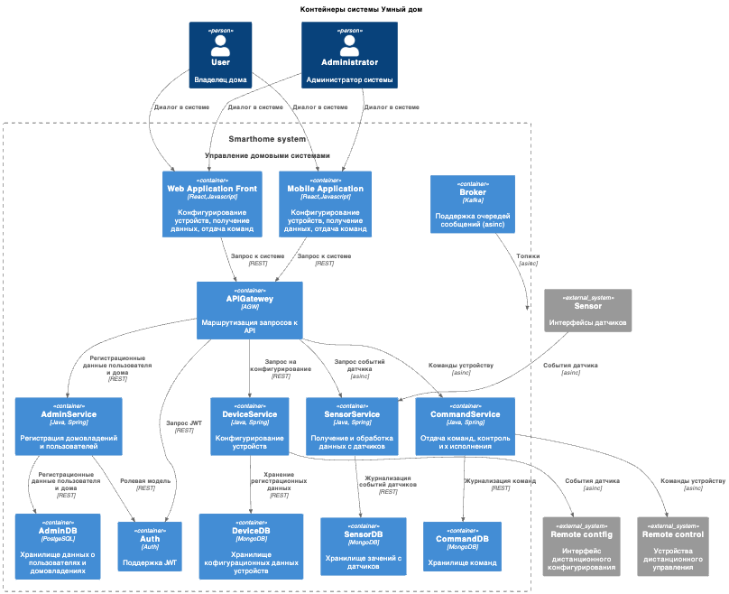
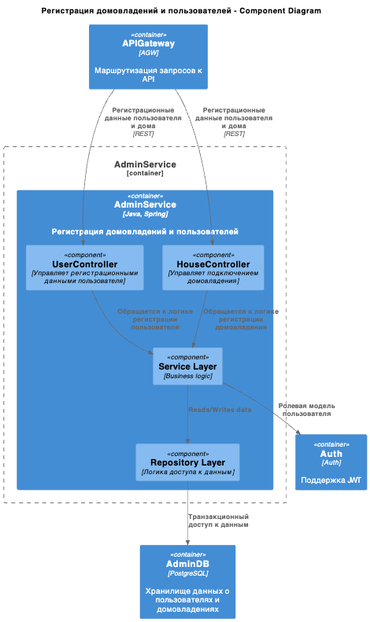
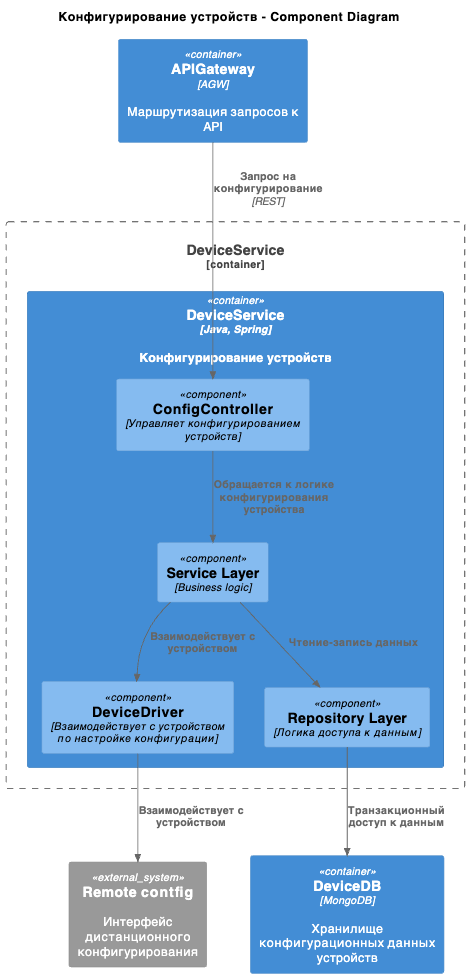
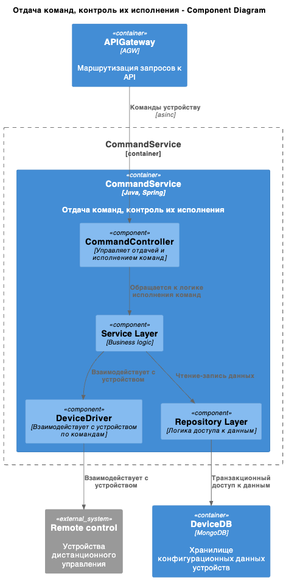
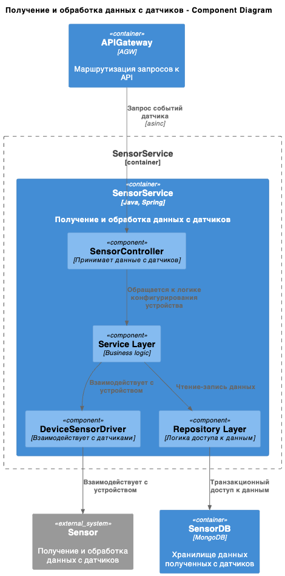
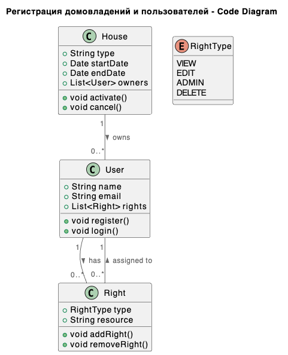
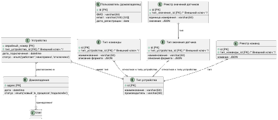

# Project_template

~~Это шаблон для решения проектной работы. Структура этого файла повторяет структуру заданий. Заполняйте его по мере работы над решением.~~

# Задание 1. Анализ и планирование

<aside>
💡

~~Чтобы составить документ с описанием текущей архитектуры приложения, можно часть информации взять из описания компани и условия задания. Это нормально.~~

</aside>

### 1. Описание функциональности монолитного приложения

**Управление отоплением и мониторинг температуры**
- Пользователи могут:
  - получать данные о системе отопления в доме - включена она или выключена, целевая и текущая температура
  - изменить данные о системе отопления в доме
  -  включить  отопление в доме
  -  выключать  отопление в доме
  - установить целевое значение температуры
  - получить текущее значение температуры
- Система поддерживает соответсвующие эндпоинты в REST-API
  - GET /api/heating/{id} вызывает heatingSystemService.getHeatingSystem(id), чтобы получить данные о системе отопления
  - PUT /api/heating/{id} вызывает heatingSystemService.updateHeatingSystem(id, heatingSystemDto) для обновления данных системы
  - POST /api/heating/{id}/turn-on вызывает heatingSystemService.turnOn(id) для включения системы
  - POST /api/heating/{id}/turn-off вызывает heatingSystemService.turnOn(id) для выключения системы
  - POST /api/heating/{id}/set-temperature вызывает heatingSystemService.setTargetTemperature(id, temperature) для установки целевой температуры, логика автоматического поддержания температуры должна быть реализована в сервисе
  - GET /api/heating/{id}/current-temperature вызывает heatingSystemService.getCurrentTemperature(id) для получения текущей температуры
- Система использует объект DTO который содержит информацию о системе отопления ( ID, статус, температура). Он используется для обмена данными между клиентом и сервером
- Система логгирует действия на API с помощью logger.info

В проекте отсутствуют компоненты, отвечающие за взаимодействие с датчиками как описано в  задании "Всё управление идёт от сервера к датчику. Данные о температуре также получаются через запрос от сервера к датчику." видимо их реализация ещё только в плане

### 2. Анализ архитектуры монолитного приложения

~~Перечислите здесь основные особенности текущего приложения: какой язык программирования используется, какая база данных, как организовано взаимодействие между компонентами и так далее.~~

Приложение реализовано на языке Java с использованием фреймворка Spring. В соответсвии с подходом Spring оно разделено на компоненты которые могут в основном  быть использованы "как есть" при декомпозиции на микросервисы, это сокращает объем работы 
  - контролеры для каждого эндпоинта обеспечивают реакцию на соответсвующий вызов API, обращаясь к методам сервиса HeatingSystemService
  - сервис HeatingSystemService реализует обработку запросов с обращением к БД посредством репозитория HeatingSystemRepository  
    - Сущность HeatingSystem ( аннотированная @Entity) представляет таблицу в базе данных, где каждая запись соответствует одной системе отопления.
Поля сущности (например, id, isOn, targetTemperature, currentTemperature) сопоставлены с колонками таблицы.

### 3. Определение доменов и границы контекстов

~~Опишите здесь домены, которые вы выделили.~~

Монолитное решение реализует по факту 2 домена обозначенные в его описании:
1. Управление отоплением. Границы контекста- данные о системе отопления, команды на включение и отключение отопления,
2. Мониторинг температуры. Границы контекста - значения датчиков температуры, целевые значения температуры
### **4. Проблемы монолитного решения**

- отсутсвие реализации автоматического опроса датчиков и передачи команд
- отсутвие возможности горизонтального масштабирования, необходимого в связи с новыми вызовами - требуется сущесвенное расширение клиентской базы, состава услуг и повышение уровня автоматизации
- сложность управления разработкой при расширении состава команды - зависимость между компонентами которые могли бы разрабатываться параллельно

~~Если вы считаете, что текущее решение не вызывает проблем, аргументируйте свою позицию.~~

### 5. Визуализация контекста системы — диаграмма С4

~~Добавьте сюда диаграмму контекста в модели C4.~~


~~Чтобы добавить ссылку в файл Readme.md, нужно использовать синтаксис Markdown. Это делают так:~~

~~```markdown~~
~~[Текст ссылки](URL)~~
~~```~~

~~Замените `Текст ссылки` текстом, который хотите использовать для ссылки. Вместо `URL` вставьте адрес, на который должна вести ссылка.Например:~~

~~```markdown~~
~~[Посетите Яндекс](https://ya.ru/)~~
~~```~~

# Задание 2. Проектирование микросервисной архитектуры

~~В этом задании вам нужно предоставить только диаграммы в модели C4. Мы не просим вас отдельно описывать получившиеся микросервисы и то, как вы определили взаимодействия между компонентами To-Be системы. Если вы правильно подготовите диаграммы C4, они и так это покажут.~~

**Диаграмма контейнеров (Containers)**



**Диаграмма компонентов (Components)**

~~Добавьте диаграмму для каждого из выделенных микросервисов.~~








**Диаграмма кода (Code)**

~~Добавьте одну диаграмму или несколько.~~


# Задание 3. Разработка ER-диаграммы

~~Добавьте сюда ER-диаграмму. Она должна отражать ключевые сущности системы, их атрибуты и тип связей между ними.~~



~~Четвёртое задание — дополнительное. Его можно сделать по желанию. Чтобы ревьюер быстрее проверил ваше решение, укажите, сделали вы это задание или нет. Для этого оставьте нужный эмодзи около заголовка задания:~~

~~✅ — вы выполнили задание.


# ✅  Задание 4. Создание и документирование API

### 1. Тип API

~~Укажите, какой тип API вы будете использовать для взаимодействия микросервисов. Объясните своё решение.~~

Тип API указан на связях диаграммы контейнеров:
- для сервисов Регистрация домовледений и пользователей и Конфигурирование устройств предусмотрен синхронный REST API поскольку нагрузка на эти сервисы относительно не высокая и предсказуемая, зависит от планов монтажа оборудоваеия в домовладениях
- для сервислв Получение и обработка данных с датчиков и Отдача команд и контроль их исполнения предусмотрен асинхронный API, поскольку они должны обрабатывать интенсивные потоки запросов с зараннее не прогнозируемыми пиками нагрузки, которые могут быть расшиты с помощью очередей сообщений - каждый запрос будет гарантированно обработан, возможно с задержкой, пиковая нагрузка не вызовет блокировки

### 2. Документация API

~~Здесь приложите ссылки на документацию API для микросервисов, которые вы спроектировали в первой части проектной работы. Для документирования используйте Swagger/OpenAPI или AsyncAPI.~~

[Swagger-спецификация](./HouseOwnershipAPI.yaml)

файл Swagger для ендпойнтов 
- Получить данные по домовладению и пользователям
- Создать новое домовладение и пользователей

[AsyncAPI-спецификация](./SmartHomeKafkaGatewayAPI.yaml)

файл AsyncAPI для операций APIGateway
- Публикация команды датчику
- Подписка на данные датчика

Документация с описанием настроек API, структуры сообщений и примерами формируется автоматически редакторами Swagger и AsyncAPI соответсвенно:

https://studio.asyncapi.com/

https://editor.swagger.io/
